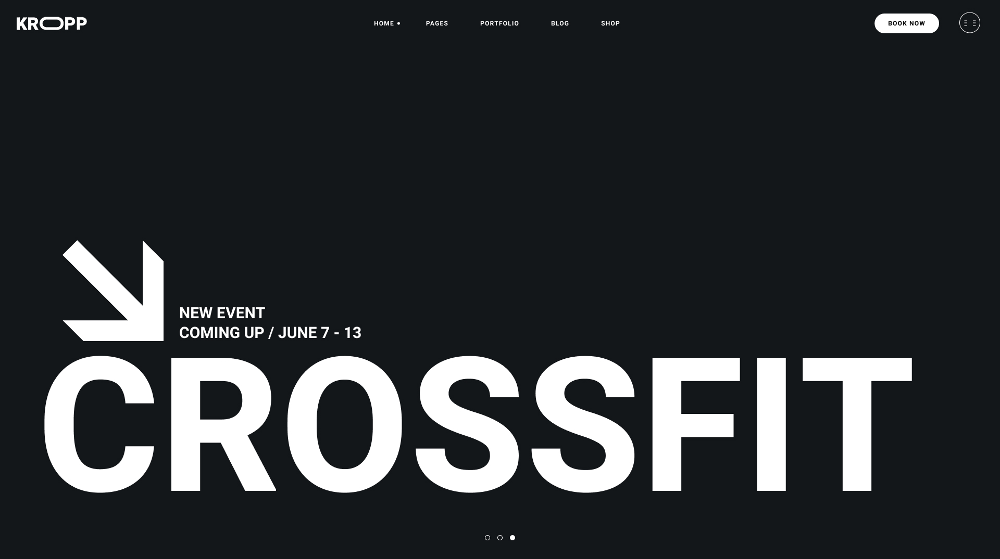

# Kropp Fitness



Kropp Fitness is a fully responsive landing page crafted for modern gyms, fitness clubs, and personal trainers. Featuring a bold, dark-themed aesthetic and a fully responsive layout, it is designed to maximize user engagement through strategically placed call-to-actions and immersive visual sections. The codebase exemplifies clean, semantic HTML5 and a scalable, modular CSS architecture.

## Features

- **Responsive Design**: optimized for desktop, tablet, and mobile devices.
- **Modular CSS**: styles are organized using a component-based structure for better maintainability.
- **UI Components**:
  - **BMI Calculator**: Layout for body mass index calculation form.
  - **Video Section**: Placeholder for video content integration.
  - **Forms**: Styled subscription and contact inputs.
- **Comprehensive Sections**:
  - **Banner**: dynamic event announcements and easy navigation.
  - **Motivation**: inspiring cards with call-to-action buttons.
  - **Training Types**: grid layout displaying available workout programs.
  - **Join Us**: highlighted membership section with video background capability.
  - **Location**: map integration and branch details.
  - **Fit Family**: gallery section for community engagement.
  - **Footer**: quick links, working hours, and social media integration.

## Technologies Used

- **HTML5**: semantic structure and accessibility best practices.
- **CSS3**: custom properties (variables), flexbox, grid, and refined typography.
- **Modular Architecture**: component-based file structure for maintainable styling.

## Project Structure

```text
kropp-fitness/
├── index.html          # Main entry point
├── assets/             # Static assets
│   ├── fonts/          # Web fonts (Heebo, Yantramanav)
│   ├── icons/          # SVG icons
│   └── images/         # Content images and backgrounds
└── styles/             # Stylesheets
    ├── main.css        # Main import file
    ├── base/           # Global styles, resets, and variables
    ├── layout/         # Section-specific styles (Header, Footer, Banner, etc.)
    └── components/     # Reusable UI components (Buttons, Inputs)
```

## Getting Started

To view the project locally:

1.  Clone or download the repository.
2.  Open the `index.html` file in any modern web browser.
3.  For the best development experience, use a local server (e.g., Live Server for VS Code) to ensure all assets load correctly.

## Customization

The project uses a centralized variable system in `styles/base/variables.css`. You can easily customize the color scheme, typography, and spacing by modifying the root variables.

## Credits

Designed with a focus on modern web standards. Original concept inspired by Kropp theme from Qode Interactive.

## License

This project is open source and available for personal and educational use.
